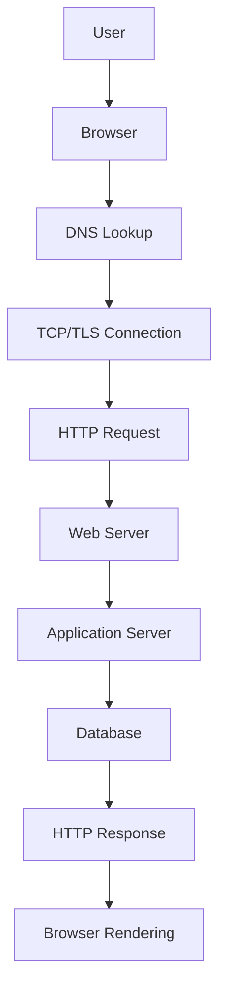
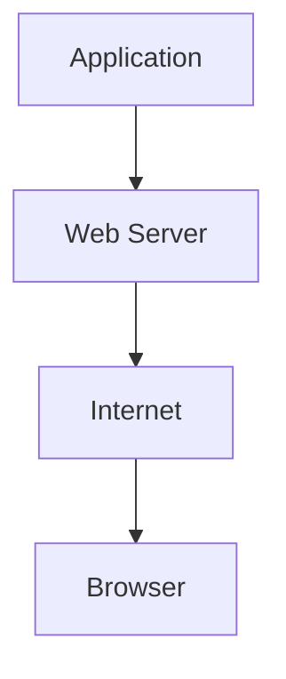
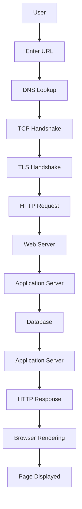
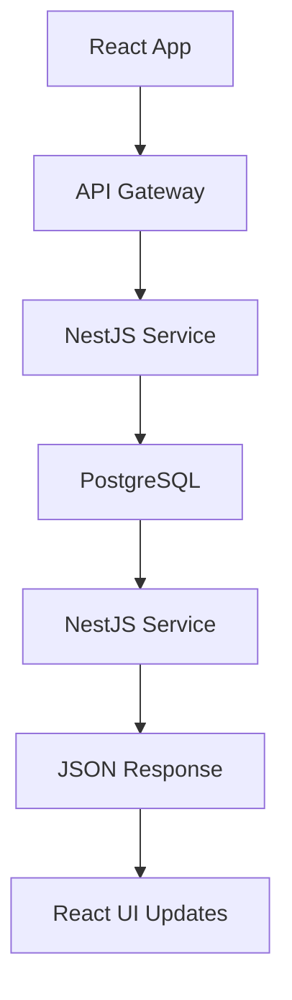

# HTTP Request Lifecycle

<!-- START doctoc generated TOC please keep comment here to allow auto update -->
<!-- DON'T EDIT THIS SECTION, INSTEAD RE-RUN doctoc TO UPDATE -->
**Table of Contents**  *generated with [DocToc](https://github.com/thlorenz/doctoc)*

- [Introduction](#introduction)
- [High-Level Overview](#high-level-overview)
- [Example Scenario](#example-scenario)
- [Step 1: URL Entry](#step-1-url-entry)
- [Step 2: DNS Lookup](#step-2-dns-lookup)
- [Step 3: TCP (Transmission Control Protocol) Connection](#step-3-tcp-transmission-control-protocol-connection)
  - [TCP Three-Way Handshake](#tcp-three-way-handshake)
- [Step 4: TLS (Transport Layer Security) Handshake (HTTPS)](#step-4-tls-transport-layer-security-handshake-https)
- [Step 5: HTTP Request Sent](#step-5-http-request-sent)
- [Step 6: Web Server Receives Request](#step-6-web-server-receives-request)
- [Step 8: Database Query](#step-8-database-query)
- [Step 9: HTTP Response Generated](#step-9-http-response-generated)
- [Step 10: Response Sent Back](#step-10-response-sent-back)
- [Step 11: Browser Rendering](#step-11-browser-rendering)
- [Complete Request Lifecycle Diagram](#complete-request-lifecycle-diagram)
- [Real Backend Example](#real-backend-example)
- [Key Takeaways](#key-takeaways)

<!-- END doctoc generated TOC please keep comment here to allow auto update -->

## Introduction

Every time a user visits a website, clicks a link, submits a form, or loads data from an API, a series of networking events occur behind the scenes.

Understanding the HTTP request lifecycle is fundamental for backend engineers because it explains how browsers, DNS servers, networks, web servers, applications, and databases work together.

This document follows a request from the moment a URL is entered until the page is rendered in the browser.

---

## High-Level Overview



---

## Example Scenario

Suppose a user enters:

<https://github.com>

into their browser.

The browser must determine:

1. Where GitHub's servers are located.
2. How to connect to them.
3. What resource is being requested.
4. How to display the returned content.

---

## Step 1: URL Entry

The user enters:

```text
https://github.com
```

The browser parses the URL.

Components:

```text
Protocol: https
Host: github.com
Path: /
```

The browser checks:

- Browser cache
- DNS cache
- Existing connections

before making any network requests.

---

## Step 2: DNS Lookup

Computers communicate using IP addresses.

The browser must translate:

```text
github.com
```

into something like:

```text
140.82.xxx.xxx
```

This process is called DNS Resolution.

The browser may query:

- Browser cache
- Operating system cache
- Router cache
- ISP DNS resolver
- Authoritative DNS server

Result:

```text
github.com -> 140.82.xxx.xxx
```

Now the browser knows where to send the request.

---

## Step 3: TCP (Transmission Control Protocol) Connection

HTTP requires a transport protocol.

Traditionally:

```text
HTTP/1.1 -> TCP
HTTP/2   -> TCP
```

The browser establishes a TCP connection using the Three-Way Handshake.

### TCP Three-Way Handshake

```text
Client                Server

SYN      ----------->
         <----------- SYN-ACK
ACK      ----------->
```

After this process, a reliable connection exists.

---

## Step 4: TLS (Transport Layer Security) Handshake (HTTPS)

Because the URL uses HTTPS, the browser must create an encrypted connection.

The browser and server:

- Exchange certificates
- Verify identity
- Negotiate encryption keys

Result:

```text
Secure encrypted channel established
```

Now all communication is encrypted.

---

## Step 5: HTTP Request Sent

The browser creates an HTTP request.

Example:

```http
GET / HTTP/1.1
Host: github.com
User-Agent: Chrome
Accept: text/html
```

The request contains:

- Method
- URL path
- Headers
- Optional body

The request travels across the internet to the server.

---

## Step 6: Web Server Receives Request

The request arrives at a web server.

Examples:

- Nginx
- Apache
- Caddy

Responsibilities:

- Accept connections
- Handle TLS
- Route requests
- Serve static files
- Forward requests to applications

Example:

```mermaid
graph TD

A[Browser];
B[Nginx];

A --> B
---

## Step 7: Application Processing

The web server forwards the request to an application.

Examples:

- Node.js
- Express
- NestJS
- Django
- Spring Boot
- ASP.NET

The application:

- Validates input
- Executes business logic
- Checks permissions
- Processes data

Example:

```text
GET /users/1
```

Application logic:

```text
Find user with ID 1
```

---

## Step 8: Database Query

If data is required, the application queries a database.

Examples:

- PostgreSQL
- MySQL
- MongoDB
- Redis

Query:

```sql
SELECT * FROM users
WHERE id = 1;
```

Database returns:

```json
{
  "id": 1,
  "name": "John Doe"
}
```

The application formats the response.

---

## Step 9: HTTP Response Generated

The application creates a response.

Example:

```http
HTTP/1.1 200 OK
Content-Type: application/json

{
  "id": 1,
  "name": "John Doe"
}
```

Response contains:

- Status code
- Headers
- Response body

---

## Step 10: Response Sent Back

The response travels back through:



The browser receives the response.

---

## Step 11: Browser Rendering

The browser interprets the response.

If HTML:

```html
<h1>Hello World</h1>
```

the browser:

1. Parses HTML
2. Downloads CSS
3. Downloads JavaScript
4. Builds DOM
5. Builds CSSOM
6. Creates Render Tree
7. Paints pixels to screen

User finally sees the webpage.

---

## Complete Request Lifecycle Diagram



---

## Real Backend Example

A React application requests user data:

```http
GET /api/users/1
```

Flow:



This same pattern powers:

- Social media apps
- Banking systems
- Payment gateways
- E-commerce websites
- Cloud platforms

---

## Key Takeaways

- Browsers communicate with servers using HTTP.
- DNS converts domain names into IP addresses.
- TCP establishes reliable communication.
- TLS encrypts communication for HTTPS.
- Applications process business logic.
- Databases store and retrieve data.
- Responses travel back to the browser.
- Browsers render the returned content for users.

Every web application ultimately follows this lifecycle.
